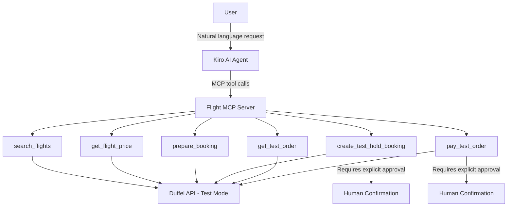
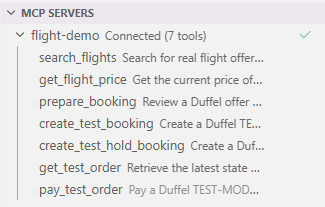
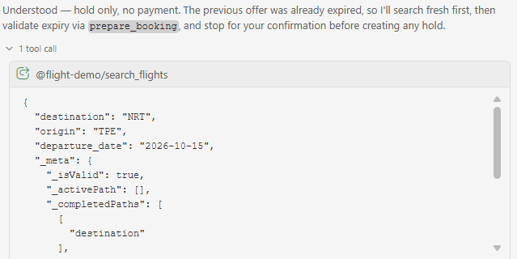
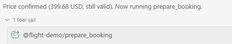
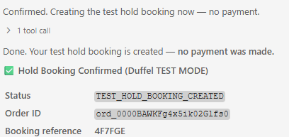
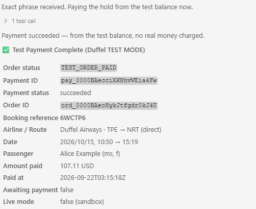

# Flight MCP Agent ✈️🤖

A small side project demonstrating how an AI agent can use **Model Context Protocol (MCP)** tools to search flights, compare offers, prepare a booking, create a sandbox hold order, and complete a sandbox payment through the **Duffel Flights API**.

The project is designed around **human-in-the-loop safety**: search and read-only actions may run automatically, while booking and payment actions require explicit user confirmation.

> **Important:** This project currently uses **Duffel Test Mode only**. It does not book real flights and does not charge real money.

---

## Why I Built This

The goal of this project is to explore how an AI agent can go beyond answering questions and safely interact with external APIs through MCP.

Instead of manually calling functions such as:

```text
search_flights()
get_flight_price()
prepare_booking()
create_booking()
pay_order()
```

the user can simply describe the travel request in natural language, for example:

```text
Find me a direct economy flight from TPE to NRT on 2026-10-15.
Prefer Duffel Airways test flights.
Reconfirm the price and prepare the booking.
Stop before any booking or payment and ask for my confirmation.
```

The agent decides which MCP tools to call and in what order.

---

## Architecture



### MCP Server Connected

The Kiro agent discovers the tools exposed by the local `flight-demo`
MCP server.



### Main flow

```text
Natural-language request
        ↓
search_flights
        ↓
Agent compares offers
        ↓
get_flight_price
        ↓
prepare_booking
        ↓
Human approval
        ↓
create_test_hold_booking
        ↓
get_test_order
        ↓
Human approval
        ↓
pay_test_order
        ↓
TEST_ORDER_PAID
```

---

## Features

- Natural-language flight search through an AI agent
- MCP-based tool discovery and execution
- Duffel Flight Offers API integration
- One-way and round-trip flight search
- Offer sorting and direct-flight filtering
- Latest-price revalidation before booking
- Pre-booking summary generation
- Duffel Test Mode hold-order creation
- Test-order retrieval
- Test balance payment
- Explicit human confirmation before transactional actions
- Safety checks preventing accidental live-mode booking/payment
- Environment-variable based API credential handling

---

## MCP Tools

| Tool | Purpose | Auto-approve? |
|---|---|---:|
| `search_flights` | Search Duffel flight offers | Yes |
| `get_flight_price` | Retrieve the latest price for an offer | Yes |
| `prepare_booking` | Build a read-only pre-booking summary | Yes |
| `get_test_order` | Retrieve the latest sandbox order state | Yes |
| `create_test_hold_booking` | Create a Duffel Test Mode hold order | **No** |
| `pay_test_order` | Pay a sandbox hold order using Duffel test balance | **No** |
| `create_test_booking` | Optional sandbox booking tool; not part of the main hold-flow demo | **No** |

Transactional tools are deliberately excluded from automatic approval.

---

## Safety Design

The project intentionally separates **read-only actions** from **transactional actions**.

### Read-only / low-risk

These can be auto-approved:

```text
search_flights
get_flight_price
prepare_booking
get_test_order
```

### Transactional

These require explicit human approval:

```text
create_test_hold_booking
pay_test_order
```

The booking tool also requires the exact confirmation phrase:

```text
CONFIRM_TEST_HOLD_BOOKING
```

The payment tool requires:

```text
CONFIRM_TEST_PAYMENT
```

Additional safeguards include:

- Duffel access token must start with `duffel_test_`
- Offer/order must have `live_mode == false`
- Expired offers are rejected
- Already-paid or cancelled orders are rejected
- Payment amount and currency are read from the latest Duffel order instead of user input
- No real card information is accepted
- No live booking or live payment logic is implemented

---

## Tech Stack

- Python 3.10+
- Model Context Protocol (MCP)
- MCP Python SDK
- `httpx`
- Duffel Flights API
- Kiro as the MCP host / AI agent
- Duffel Test Mode

---

## Project Structure

A minimal repository can look like this:

```text
flight-mcp/
├── server.py
├── README.md
├── requirements.txt
├── .gitignore
├── .env.example
└── .kiro/
    └── settings/
        └── mcp.json.example
```

Do **not** commit your real `mcp.json` if it contains secrets.

---

## Setup

### 1. Clone the repository

```bash
git clone https://github.com/hsin0616/Flight-mcp-agent.git
cd flight-mcp
```

### 2. Create a virtual environment

Windows:

```powershell
py -m venv .venv
.\.venv\Scripts\Activate.ps1
```

macOS / Linux:

```bash
python3 -m venv .venv
source .venv/bin/activate
```

### 3. Install dependencies

```bash
pip install "mcp[cli]" httpx
```

Or, if a `requirements.txt` is included:

```bash
pip install -r requirements.txt
```

### 4. Create a Duffel Test Mode token

Create a Duffel developer account and generate a **Test Mode** access token.

The token should look similar to:

```text
duffel_test_...
```

### 5. Store the token as an environment variable

Windows PowerShell:

```powershell
setx DUFFEL_ACCESS_TOKEN "duffel_test_your_token_here"
```

Open a new terminal after using `setx`.

Check it with:

```powershell
echo $env:DUFFEL_ACCESS_TOKEN
```

macOS / Linux:

```bash
export DUFFEL_ACCESS_TOKEN="duffel_test_your_token_here"
```

> Never hard-code API tokens inside `server.py`.

---

## Kiro MCP Configuration

Create:

```text
.kiro/settings/mcp.json
```

Example:

```json
{
  "mcpServers": {
    "flight-demo": {
      "command": "C:\\ABSOLUTE\\PATH\\TO\\flight-mcp\\.venv\\Scripts\\python.exe",
      "args": [
        "C:\\ABSOLUTE\\PATH\\TO\\flight-mcp\\server.py"
      ],
      "env": {
        "DUFFEL_ACCESS_TOKEN": "${DUFFEL_ACCESS_TOKEN}"
      },
      "disabled": false,
      "autoApprove": [
        "search_flights",
        "get_flight_price",
        "prepare_booking",
        "get_test_order"
      ]
    }
  }
}
```

Do **not** add these tools to `autoApprove`:

```text
create_test_hold_booking
pay_test_order
create_test_booking
```

If Kiro blocks environment-variable expansion, allow `DUFFEL_ACCESS_TOKEN` in Kiro's approved MCP environment-variable settings.

After saving the MCP configuration, reconnect the `flight-demo` server.

---

## Example Demo

### User request

```text
I want a direct economy flight from TPE to NRT on 2026-10-15
for one adult.

Prefer Duffel Airways test flights.

Find suitable flights, compare them, reconfirm the price,
and prepare a booking summary.

Any action that creates a booking or payment must stop
and ask for my explicit confirmation first.
```
### 1. Natural-language request → MCP tool

The user only describes the travel requirement.  
The agent decides to call `search_flights` through MCP.



### Agent behavior

The agent autonomously chooses:

```text
search_flights
↓
get_flight_price
↓
prepare_booking
↓
STOP for approval
```

After explicit approval:

```text
create_test_hold_booking
↓
get_test_order
↓
STOP for payment approval
```

After explicit payment approval:

```text
pay_test_order
↓
TEST_ORDER_PAID
```

Example sandbox result:

```text
booking_status: TEST_HOLD_BOOKING_CREATED
live_mode: false
awaiting_payment: true
```

After sandbox payment:

```text
payment_status: succeeded
payment_live_mode: false
awaiting_payment: false
order_status: TEST_ORDER_PAID
```

No real money is charged.

### 2. Multi-step agent workflow

The agent uses the result of one MCP tool to decide the next action.
After validating the latest price, it automatically calls
`prepare_booking`.



### 3. Sandbox hold booking

After explicit user approval, the agent creates a Duffel Test Mode
hold booking without making a payment.



Example result:

```text
booking_status: TEST_HOLD_BOOKING_CREATED
live_mode: false
awaiting_payment: true
```

### 4. Sandbox payment

After explicit user approval, the agent pays the sandbox hold order
using Duffel Test Mode balance.



Example result:

```text
payment_status: succeeded
payment_live_mode: false
awaiting_payment: false
order_status: TEST_ORDER_PAID
```

---

## What This Project Demonstrates

This project is mainly an **agentic workflow / MCP integration PoC**, rather than a production travel application.

It demonstrates:

1. **Tool discovery**  
   The AI agent understands the MCP tool schemas and decides when to call them.

2. **Multi-step agent orchestration**  
   Output from one tool becomes input to the next tool automatically.

3. **External API integration**  
   MCP tools communicate with the Duffel API instead of returning hard-coded data.

4. **Stateful transactions**  
   The workflow progresses from Offer → Hold Order → Payment.

5. **Human-in-the-loop control**  
   Transactional actions stop for explicit approval.

6. **Safety boundaries**  
   Test Mode is enforced in code, and payment values come from the latest order rather than from free-form user input.

---

## Current Limitations

This repository is intentionally a small side project.

It currently does **not** support:

- Real / live flight booking
- Real credit-card collection
- 3D Secure authentication
- Production payment processing
- Passport / identity-document handling
- Seat selection
- Paid baggage or other ancillary services
- Flight changes
- Refunds
- Cancellations
- Webhook handling
- Production-grade persistence/database
- Multiple passengers
- Production monitoring or audit storage

Duffel Test Mode data should not be treated as real-world airline availability or pricing.

---

## Before Going Live

Moving from Test Mode to production is **not** just replacing a test token with a live token.

A production version should add:

```text
Live Duffel account / production access
        ↓
Real passenger validation
        ↓
Secure checkout UI
        ↓
PCI-safe card collection
        ↓
3D Secure authentication
        ↓
Live order creation / payment
        ↓
Booking verification
        ↓
PNR + electronic-ticket verification
        ↓
Webhooks for later airline/order changes
```

Credit-card numbers should never be typed into the AI chat, MCP arguments, logs, or source code.

---

## Recommended Next Steps

For a stronger portfolio version, the highest-value improvements would be:

- [ ] Add automated unit tests for safety checks
- [ ] Add `verify_booking()` to verify order/PNR/ticket status
- [ ] Add structured logging without storing secrets
- [ ] Add a small architecture screenshot or demo GIF
- [x] Add a `.env.example`
- [x] Add `requirements.txt` or `pyproject.toml`
- [x] Add a `.gitignore`
- [ ] Add graceful handling for expired offers
- [ ] Add webhook support as a future production exercise
- [ ] Add CI with GitHub Actions
- [x] Add demo screenshots

A real-payment checkout should only be considered after the verification and security layers above are complete.

---

## Security

Never commit:

```text
DUFFEL_ACCESS_TOKEN
duffel_test_...
duffel_live_...
credit-card information
real passenger personal information
```

A recommended `.gitignore` should include at least:

```gitignore
.venv/
__pycache__/
*.pyc
.env
.kiro/settings/mcp.json
```

If an API token is ever exposed publicly, revoke it and create a new one.

---

## Status

✅ MCP server working  
✅ Kiro Agent connected through MCP  
✅ Duffel Test Mode flight search  
✅ Offer price revalidation  
✅ Pre-booking review  
✅ Sandbox hold booking  
✅ Sandbox order retrieval  
✅ Sandbox balance payment  
✅ Human approval before booking/payment  
🚧 Live booking intentionally not implemented

---

## Disclaimer

This project is for educational and portfolio purposes.

It currently operates exclusively in Duffel Test Mode. It must not be presented as a production-ready travel booking system, and the sandbox flight offers should not be interpreted as real purchasable airline inventory.
